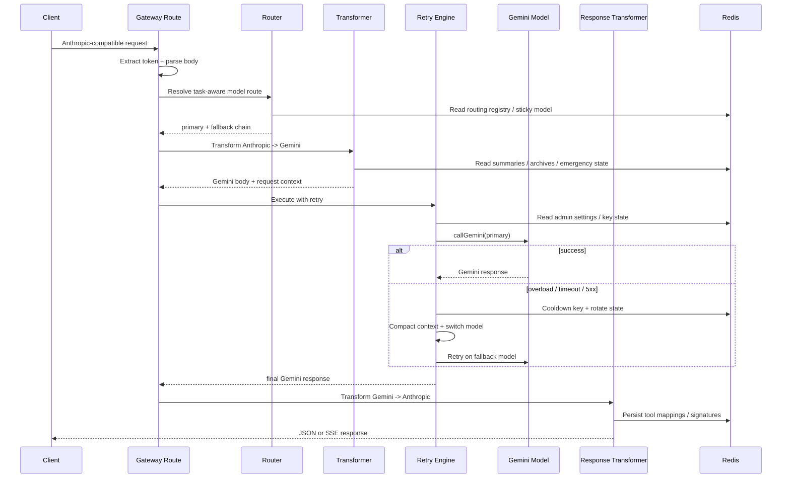
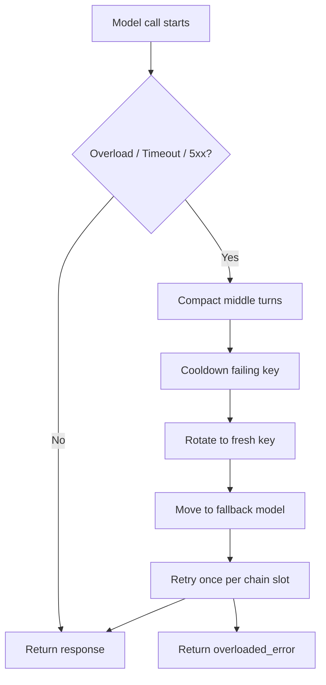

# Gateway Design

## High-Level Design

```mermaid
flowchart LR
    Client[Claude Code / Anthropic Client]
    APIRoute[/api/v1/messages]
    Auth[Auth Layer]
    Router[Task Router + Model Router]
    Transformer[Request Transformer]
    Retry[Retry Engine]
    Gemini[Gemini Adapter]
    Response[Response / Stream Transformer]
    Admin[Admin Dashboard]
    AdminAPI[/api/admin/*]
    Redis[(Redis State)]

    Client --> APIRoute
    APIRoute --> Auth
    Auth --> Router
    Router --> Transformer
    Transformer --> Retry
    Retry --> Gemini
    Gemini --> Response
    Response --> Client

    Retry <--> Redis
    Router <--> Redis
    Transformer <--> Redis
    Response <--> Redis

    Admin --> AdminAPI
    AdminAPI <--> Redis
    AdminAPI --> Router
    AdminAPI --> Retry
```

## Request Design



## Reliability Design



## Admin Control Design

- Dashboard Overview shows current runtime mode, key health, and usage.
- System Controls expose live runtime toggles such as parallel racing on/off.
- Model Routing allows runtime route overrides without redeploying.
- Provider Keys and Gateway Keys are managed separately.
- Admin sessions are backed by Redis and isolated from gateway-user tokens.

## Design Intent

This gateway is designed as a resilient execution coordinator:
- clients keep the Anthropic interface they expect
- gateway owns routing, reliability, and state repair
- Redis provides shared operational memory
- overload is handled by shrinking context and moving across keys/models
- admin can change runtime behavior live without changing code
